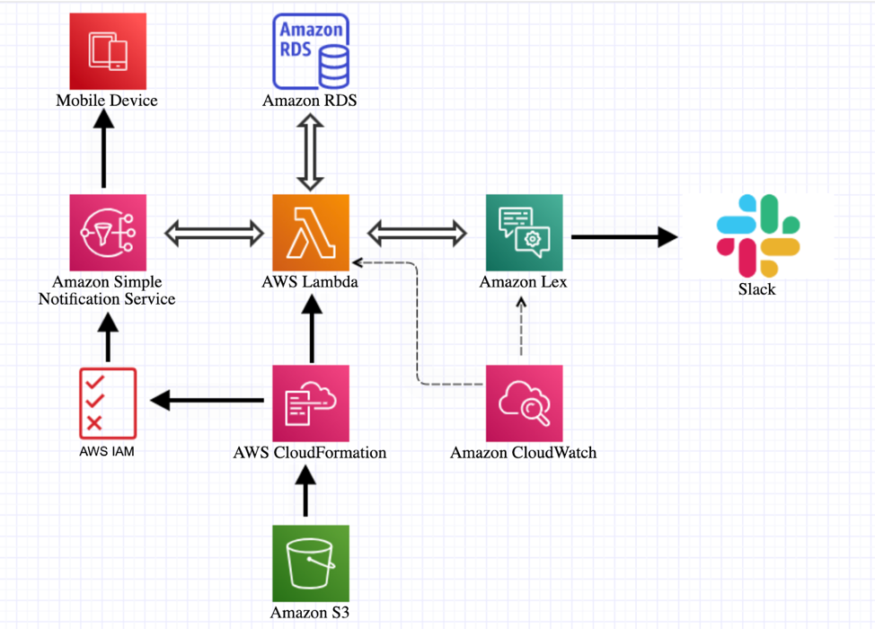

# AWS-Chatbot
A Chatbot for Student Accommodation using AWS Lex and Slack
If a student wants to reserve an apartment/room in the university campus, he/she requests the AWS chatbot to know whether the rooms are available or not. All the room availability details are maintained in Amazon RDS database and are queried based on student requirements. The availability details are fetched from the database to the Amazon Lex chatbot (via Slack) through AWS lambda. Reservation confirmation details are sent to the student phone number upon successful reservation. Various services are used throughout the project to attain different functionalities.

**Below is the architecture of the project:**

